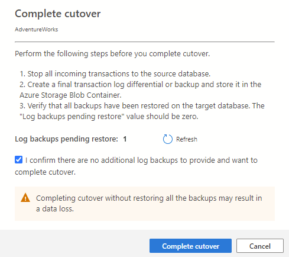

---
lab:
  title: Migrar bancos de dados do SQL Server para o SQL Server em uma máquina virtual do Azure
---

# Migrar bancos de dados do SQL Server para o SQL Server em uma máquina virtual do Azure

Neste exercício, você aprenderá a migrar um banco de dados do SQL Server para um SQL Server em uma máquina virtual do Azure, utilizando a extensão de migração do Azure para o Azure Data Studio. Comece instalando e iniciando a extensão de migração do Azure para o Azure Data Studio. A seguir, você executará uma migração online de um banco de dados do SQL Server para um SQL Server em uma máquina virtual do Azure. Você também aprenderá a monitorar o processo de migração no portal do Azure, bem como a concluir o processo de substituição para finalizar a migração.

Este exercício levará, aproximadamente, **45** minutos.

> **Observação**: para realizar este exercício, será necessário ter acesso a uma assinatura do Azure para criar recursos do Azure. Se você não tiver uma assinatura do Azure, crie uma [conta gratuita](https://azure.microsoft.com/free/?azure-portal=true) antes de começar.

## Antes de começar

Para executar este exercício, você precisará de:

| Item | Descrição |
| --- | --- |
| **Servidor de Destino** | Um SQL Server em uma máquina virtual do Azure. Para saber mais, visite [Provisionar um SQL Server em uma máquina virtual do Azure](https://microsoftlearning.github.io/dp-300-database-administrator/Instructions/Labs/01-provision-sql-vm.html). **Observação:** a versão do SQL Server entre o destino e o servidor deve ser a mesma. |
| **Servidor de Origem** | A versão mais recente do [SQL Server](https://www.microsoft.com/en-us/sql-server/sql-server-downloads) instalada em um servidor de sua escolha. |
| **Banco de Dados de Origem** | O banco de dados leve do [AdventureWorks](https://learn.microsoft.com/sql/samples/adventureworks-install-configure) a ser restaurado na instância do SQL Server 2022. |

## Provisione uma conta de armazenamento do Azure com um contêiner de blobs

O objetivo da criação de uma conta de armazenamento do Azure é armazenar os backups completos e de log de transações para a migração. Usaremos essa conta de armazenamento mais tarde neste exercício.

1. Entre no [portal do Azure](https://portal.azure.com/).
1. No menu esquerdo do portal, selecione **Contas de armazenamento** para exibir uma lista das contas de armazenamento. Se o menu do portal não estiver visível, selecione o botão de menu para ativá-lo.
1. Na página **Contas de armazenamento**, selecione **Criar**.
1. Em **Detalhes do projeto**, selecione a mesma assinatura do Azure na qual você criou a máquina virtual do Azure.
1. Selecione o mesmo grupo de recursos no qual você criou a máquina virtual do Azure. 
1. Escolha um nome exclusivo para a sua conta de armazenamento e selecione a mesma região da máquina virtual do Azure.
1. Escolha **Standard** como nível de serviço.
1. Deixe os demais valores como o padrão.
1. Selecione **Examinar + criar**e **Criar**.

Depois que a conta de armazenamento for criada, crie um contêiner seguindo estas etapas:

1. Navegue até a conta de armazenamento recém-criada no portal do Azure.
1. No menu à esquerda da conta de armazenamento, role a página até **Serviço Blob** e selecione **Contêineres**.
1. Escolha **+ Contêiner** para criar um contêiner.
1. Na página lateral Novo contêiner, forneça as seguintes informações:
    - **Nome:***nome de sua preferência*
    - **Nível de acesso público:** particular
1. Selecione **Criar**.

## Instale e inicie a extensão de migração do Azure para o Azure Data Studio

Antes de começar a utilizar a extensão de migração do Azure, será preciso instalar o [Azure Data Studio](https://learn.microsoft.com/sql/azure-data-studio/download-azure-data-studio). Para esse cenário, instale o Azure Data Studio no mesmo servidor em que o banco de dados de origem está localizado. A extensão está disponível no marketplace do Azure Data Studio.

Para instalar a extensão de migração, siga estas etapas:

1. Abra o gerenciador de extensões no Azure Data Studio.
1. Pesquise ***Migração do SQL do Azure*** e selecione a extensão.
1. Instalar a extensão. Depois de instalá-la, a extensão de Migração SQL do Azure estará na lista de extensões instaladas.
1. Conecte-se a uma instância do SQL Server no Azure Data Studio.
1. Para iniciar uma extensão de migração do Azure, clique com o botão direito do mouse no nome da instância de origem e selecione **Gerenciar** para acessar o painel e a página de destino da extensão de migração SQL do Azure.

## Execute uma migração online de um banco de dados do SQL Server para um SQL Server em execução em uma máquina virtual do Azure.

Para executar uma migração com tempo de inatividade mínimo utilizando o Azure Data Studio, siga estas etapas:

1. Inicie o assistente de Migração para o SQL do Azure na extensão do Azure Data Studio.

1. Na **Etapa 1: bancos de dados para avaliação**, selecione o banco de dados que deseja migrar e selecione **Avançar**.
    
    > **Observação**: é recomendável coletar dados de desempenho e obter recomendações do Azure adequadas.

1. Na **Etapa 2: resultados e recomendações da avaliação**, aguarde a conclusão da avaliação e selecione **SQL Server na máquina virtual do Azure** como destino do **SQL do Azure**.

1. Na parte inferior da página **Etapa 2: resultados e recomendações da avaliação**, selecione **Exibir/selecionar** para exibir os resultados da avaliação. Selecione o banco de dados para migrar. 

    > **Observação**: reserve um momento para analisar os resultados da avaliação no lado direito.

1. Na **Etapa 3: destino do SQL do Azure**, selecione uma conta do Azure e seu SQL Server de destino na máquina virtual do Azure.

    

1. Na **Etapa 4: Serviço de Migração de Banco de Dados do Azure**, crie um novo Serviço de Migração de Banco de Dados do Azure utilizando o assistente do Azure Data Studio. Se você já criou um anteriormente, pode reutilizá-lo. Como alternativa, você pode criar um recurso do Serviço de Migração de Banco de Dados do Azure através do portal do Azure.

    > **Observação**: certifique-se de que a assinatura esteja registrada para usar o namespace **Microsoft.DataMigration**. Para saber como realizar o registro de um provedor de recursos, consulte [Registrar o provedor de recursos](https://learn.microsoft.com/azure/dms/quickstart-create-data-migration-service-portal#register-the-resource-provider).

1. Faça backup do banco de dados de origem. Você pode [fazer backup no Armazenamento de Blobs do Microsoft Azure usando o SSMS ou o T-SQL](https://learn.microsoft.com/en-us/sql/relational-databases/backup-restore/sql-server-backup-to-url). Como alternativa, você também tem a opção de copiar manualmente o backup do banco de dados para uma pasta de contêiner usando o portal do Azure.

    > **Observação**: certifique-se de que uma pasta seja criada no contêiner antes de prosseguir com a cópia do arquivo de backup.

1. Na **Etapa 5: configuração da fonte de dados**, selecione o local dos backups de banco de dados, seja em um compartilhamento de rede local, seja em um contêiner do Armazenamento de Blobs do Azure.

1. Inicie a migração de banco de dados e monitore o progresso no Azure Data Studio. Você também pode acompanhar o progresso no portal do Microsoft Azure no recurso Serviço de Migração de Banco de Dados do Azure.

    > **Observação**: os serviços de migração de dados do Azure irão orquestrar e restaurar automaticamente os arquivos de backup no servidor de destino.

1. Selecione **Migrações de banco de dados em andamento** no painel de migração para exibir as migrações em andamento. 

    

1. Selecione o nome do banco de dados para obter mais detalhes.

    

## Monitore as migrações no portal do Azure

Alternativamente, você também pode monitorar a atividade de migração utilizando o Serviço de Migração de Banco de Dados do Azure. 

1. 
    
    
## Conclua o processo de substituição

1. Faça um [backup do final do log](https://learn.microsoft.com/sql/relational-databases/backup-restore/tail-log-backups-sql-server) para o banco de dados de origem.

1. No portal do Azure, carregue o backup de log de transações no contêiner e na pasta onde o arquivo de backup completo está localizado.

1. Na extensão de migração do Azure, selecione **Concluir substituição** na página de monitoramento.

    

1. Verifique se todos os backups de logs foram restaurados no banco de dados de destino. O valor de **backups de logs com restauração pendente** deve ser zero. Esta etapa conclui a migração.

    

1. A propriedade de status da migração será alterada para **Concluindo** e, em seguida, para **Bem-sucedido** após a conclusão da migração.

    > **Observação**: é possível concluir a substituição usando etapas semelhantes com o Serviço de Migração de Banco de Dados do Azure através do portal do Azure.

1. Depois que o status se tornar **Bem-sucedido**, navegue até o servidor de destino e valide o banco de dados de destino. Verifique o esquema e os dados do banco de dados.

Neste exercício, você aprendeu a migrar um banco de dados do SQL Server para um SQL Server em uma máquina virtual do Azure usando a extensão de migração do Azure para o Azure Data Studio. Você também aprendeu como concluir o processo de substituição para finalizar a migração. Isso garante que todos os dados foram migrados com êxito e que o novo banco de dados está totalmente operacional. Quando o processo de substituição estiver concluído, você poderá começar a usar seu novo banco de dados do SQL Server em uma máquina virtual do Azure. 

## Limpar

Quando você está trabalhando em sua própria assinatura, é uma boa ideia identificar, no final de um projeto, se você ainda precisa dos recursos criados. 

Deixar os recursos sendo executados desnecessariamente pode resultar em custos adicionais. É possível excluir os recursos individualmente ou excluir todo o conjunto de recursos no [portal do Azure](https://portal.azure.com?azure-portal=true).

## Mais informações

Para obter mais informações sobre o SQL Server em máquinas virtuais do Azure, veja [O que é o SQL Server nas máquinas virtuais do Azure?](https://learn.microsoft.com/en-us/azure/azure-sql/virtual-machines/windows/sql-server-on-azure-vm-iaas-what-is-overview?view=azuresql-vm)
