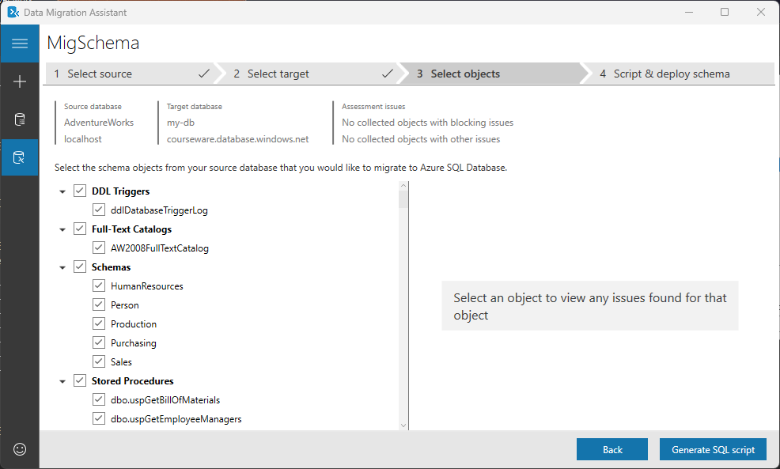
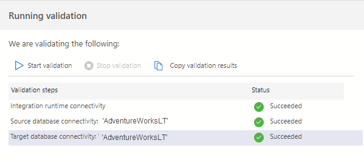
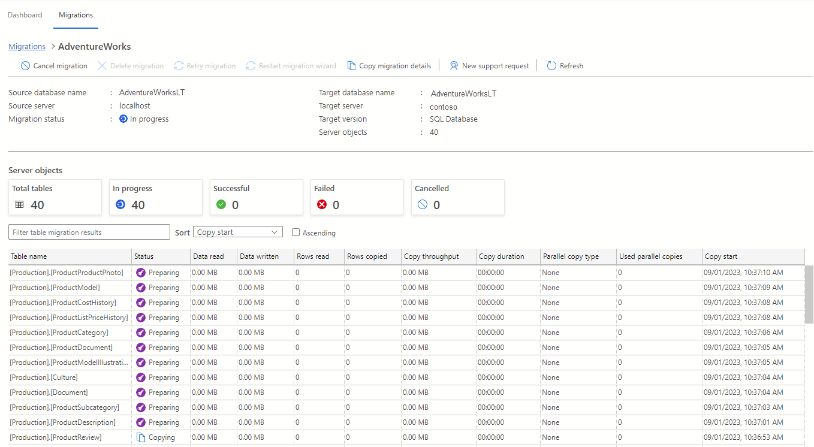

---
lab:
  title: Migrar bancos de dados do SQL Server para o Banco de Dados SQL do Azure
---

# Migrar bancos de dados do SQL Server para o Banco de Dados SQL do Azure

Neste exercício, você aprenderá a migrar um banco de dados do SQL Server para um Banco de Dados SQL do Azure usando a extensão de migração do Azure para o Azure Data Studio. Comece instalando e iniciando a extensão de migração do Azure para o Azure Data Studio. A seguir, execute uma migração offline de um banco de dados do SQL Server para um Banco de Dados SQL do Azure. Você também aprenderá a monitorar o processo de migração no portal do Azure.

Este exercício levará, aproximadamente, **45** minutos.

> **Observação**: para realizar este exercício, será necessário ter acesso a uma assinatura do Azure para criar recursos do Azure. Se você não tiver uma assinatura do Azure, crie uma [conta gratuita](https://azure.microsoft.com/free/?azure-portal=true) antes de começar.

## Antes de começar

Para executar este exercício, você precisa:

| Item | Descrição |
| --- | --- |
| **Servidor de destino** | Um servidor do Banco de Dados SQL do Azure. Iremos criá-lo durante este exercício.|
| **Banco de dados de destino** | Um banco de dados em um servidor do Banco de Dados SQL do Azure. Iremos criá-lo durante este exercício.|
| **Servidor de origem** | Uma instância do SQL Server 2019 ou [posterior](https://www.microsoft.com/en-us/sql-server/sql-server-downloads) instalada em um servidor de sua preferência. |
| **Banco de dados de origem** | O banco de dados leve do [AdventureWorks](https://learn.microsoft.com/sql/samples/adventureworks-install-configure) a ser restaurado na Instância do SQL Server. |
| **Azure Data Studio** | Instale o [Azure Data Studio](https://learn.microsoft.com/sql/azure-data-studio/download-azure-data-studio) no mesmo servidor onde o banco de dados de origem está localizado. Se já estiver instalado, atualize-o para garantir a utilização da versão mais recente. |
| **Assistente de migração de dados da Microsoft** | Instale o [Assistente de Migração de Dados](https://www.microsoft.com/en-us/download/details.aspx?id=53595) no mesmo servidor em que o banco de dados de origem está localizado. |
| Provedor de recursos **Microsoft.DataMigration** | Certifique-se de que a assinatura esteja registrada para usar o namespace **Microsoft.DataMigration** Para saber como realizar o registro de um provedor de recursos, consulte [Registrar o provedor de recursos](https://learn.microsoft.com/azure/dms/quickstart-create-data-migration-service-portal#register-the-resource-provider). |
| **Microsoft Integration Runtime** | Instale o [Microsoft Integration Runtime](https://aka.ms/sql-migration-shir-download). |

## Restaurar um banco de dados do SQL Server

Vamos restaurar o banco de dados do *AdventureWorksLT* na instância do SQL Server. Esse banco de dados servirá como banco de dados de origem para este exercício de laboratório. Você pode pular essas etapas se o banco de dados já estiver restaurado.

1. Selecione o botão Iniciar do Windows e digite SSMS. Selecione **Microsoft SQL Server Management Studio 18** na lista.  

1. Quando o SSMS for aberto, observe que a caixa de diálogo **Conectar ao Servidor** será pré-preenchida com o nome de instância padrão. Selecione **Conectar**.

1. Selecione a pasta**Bancos de Dados** e **Nova Consulta**.

1. Na janela Nova consulta, copie e cole o T-SQL abaixo. Execute a consulta para restaurar o banco de dados.

    ```sql
    RESTORE DATABASE AdventureWorksLT
    FROM DISK = 'C:\LabFiles\AdventureWorksLT2019.bak'
    WITH RECOVERY,
          MOVE 'AdventureWorksLT2019_Data' 
            TO 'C:\LabFiles\AdventureWorksLT2019.mdf',
          MOVE 'AdventureWorksLT2019_Log'
            TO 'C:\LabFiles\AdventureWorksLT2019.ldf';
    ```

    > **Observação**: certifique-se de que o nome e o caminho do arquivo de backup do banco de dados no exemplo acima correspondam ao arquivo de backup real. Caso contrário, o comando poderá falhar.

1. Uma mensagem de sucesso será exibida após a conclusão da restauração.

## Registre o namespace Microsoft.DataMigration

Ignore estas etapas se o namespace **Microsoft.DataMigration** já estiver registrado em sua assinatura.

1. No portal do Azure, procure **Assinatura** na caixa de pesquisa na parte superior e selecione **Assinaturas**. Selecione sua assinatura no painel **Assinaturas**.

1. Na página da sua assinatura, em **Configurações**, selecione **Provedores de recursos**. Procure **Microsoft.DataMigration** na caixa de pesquisa na parte superior e selecione **Microsoft.DataMigration**. 

    > **Observação**: se a barra lateral **Detalhes do provedor de recursos** abrir, feche-a.

1. Selecione **Registrar**.

## Provisionar um Banco de Dados SQL do Azure

Vamos configurar um Banco de Dados SQL do Azure que servirá como nosso ambiente de destino.

1. No portal do Azure, procure **Bancos de dados SQL** na caixa de pesquisa na parte superior e selecione **Bancos de dados SQL**.

1. No painel **Bancos de dados SQL**, selecione **+ Criar**.

1. Na página **Criar Banco de Dados SQL**, selecione as seguintes opções.

    - **Assinatura**: &lt;Sua assinatura&gt;
    - **Grupo de recursos**: &lt;seu grupo de recursos&gt;
    - **Nome do banco de dados**: AdventureWorksLT
    - **Servidor:** selecione o link **Criar novo**. Forneça os detalhes do servidor na página **Criar servidor do banco de dados SQL**.
        - **Nome do servidor:**&lt;escolha um nome de servidor&gt;. O nome do servidor deve ser globalmente exclusivo.
        - **Localização:**&lt; a sua região, a mesma que a do seu grupo de recursos&gt;
        - **Método de autenticação**: use a autenticação do SQL.
        - **Logon de administrador do servidor:** sqladmin
        - **Senha:** &lt;sua senha&gt;
        - **Confirmar senha:**&lt;sua senha&gt;
        
            **Observação:** guarde o nome e as credenciais deste servidor. Você os usará em etapas posteriores.

    - **Deseja usar o pool elástico do SQL?** Não
    - **Ambientes de carga de trabalho:** produção

1. Em **Computação + armazenamento**, selecione **Configurar banco de dados**. Na página **Configurar**, para a lista suspensa **Camada de serviço**, selecione **Básico** e **Aplicar**.

1. Para a opção **Redundância de armazenamento de backup**, mantenha o valor padrão: **armazenamento de backup com redundância geográfica**. Selecione **Avançar: Rede**.

1. Na guia **Rede**, selecione **Avançar: Segurança** e, em seguida, **Avançar: Configurações adicionais**.

1. Na página **Configurações adicionais**, selecione **Revisar + criar**.

1. Revise as configurações e selecione **Criar**.

1. Após a conclusão da implantação, selecione **Ir para o recurso**.

## Habilite o acesso a um Banco de dados SQL do Azure.

Iremos habilitar o acesso ao Banco de Dados SQL do Azure para que possamos nos conectar a ele por meio das ferramentas de cliente.

1. Na página **Banco de dados SQL**, selecione a seção **Visão geral** e, em seguida, selecione o link para o nome do servidor na seção superior:

1. No painel **SQL Server**, selecione **Rede** na seção **Segurança**.

1. Na guia **Acesso público**, escolha **Redes selecionadas**. 

1. Em **Regras de firewall**, selecione **+ Adicionar o endereço IPv4 do cliente**.

1. Na seção **Exceções**, marque a propriedade **Permitir que os serviços e os recursos do Azure acessem este servidor**. 

1. Selecione **Salvar**.

## Conectar-se com o Banco de Dados SQL do Azure no Azure Data Studio

Antes de começar a usar a extensão de migração do Azure, iremos nos conectar ao banco de dados de destino.

1. Iniciar o Azure Data Studio.

1. Selecione **Conexões** e, em seguida, **Adicionar conexão**.

1. Preencha os campos **Detalhes da conexão** com o nome do SQL Server e outras informações.

    > **Observação**: insira o nome do SQL Server criado anteriormente. O formato deve ser **<server>.database.windows.net**.

1. No **Tipo de autenticação**, selecione **Logon SQL** e forneça o nome de usuário e a senha.

1. Selecione **Conectar**.

## Instale e inicie a extensão de migração do Azure para o Azure Data Studio

Siga estas etapas para instalar a extensão de migração. Se a extensão já estiver instalada, você poderá ignorar estas etapas.

1. Abra o gerenciador de extensões no Azure Data Studio.

1. Pesquise ***Migração do SQL do Azure*** e selecione a extensão.

1. Instalar a extensão. Depois de instalá-la, a extensão de Migração SQL do Azure estará na lista de extensões instaladas.

1. Conecte-se a uma instância do SQL Server no Azure Data Studio. Na nova guia de conexão, selecione **Opcional (Falso)** para a opção **Criptografar**.

1. Para iniciar uma extensão de migração do Azure, clique com o botão direito do mouse no nome da instância do SQL Server e selecione **Gerenciar** para acessar o painel e a página de destino da extensão de migração SQL do Azure.

    > **Observação**: se a **Migração SQL do Azure** não estiver visível na barra lateral do painel do servidor, reabra o Azure Data Studio.
 
## Gerar o esquema de banco de dados com o AMD

Antes de começarmos a migração, precisamos verificar se o esquema existe no banco de dados de destino. Usaremos o AMD para criar o esquema a partir da origem e aplicá-lo ao destino.

1. Feche o Assistente de Migração de Dados.

1. Crie um novo projeto de migração, defina o tipo de origem como **SQL Server**, o tipo de servidor de destino como **Banco de Dados SQL do Azure** e o escopo da migração para **Somente esquema**. Selecione **Criar**.

     

1. Na guia **Selecionar origem**, insira o nome da instância do SQL Server de origem e selecione **Autenticação do Windows** para **Tipo de autenticação**. Desmarque **Criptografar conexão**. 

1. Selecione **Conectar**.

1. Selecione o banco de dados do **AdventureWorksLT** e, em seguida, selecione **Avançar**.

1. Na guia **Selecionar destino**, insira o nome do SQL Server do Azure de destino, selecione **Autenticação do SQL Server** para **Tipo de Autenticação** e forneça as credenciais de usuário do SQL. 

1. Selecione o banco de dados do **AdventureWorksLT** e, em seguida, selecione **Avançar**.

1. Na guia **Selecionar objetos**, selecione todos os objetos de esquema do banco de dados de origem. Selecione **Gerar script SQL**. 

    

1. Depois que o esquema tiver sido gerado, reserve algum tempo para revisá-lo. Geralmente, essa etapa envolve fazer os ajustes necessários no script para objetos que não podem ser criados, em seu estado atual, no local de destino, o que não é o caso neste cenário.
 
1. Você pode executar o script manualmente usando o Azure Data Studio, o SQL Management Studio ou selecionando **Implantar esquema**. Prossiga com um dos métodos.

    

## Execute uma migração offline de um banco de dados do SQL Server para um Banco de Dados SQL do Azure.

Agora estamos prontos para migrar os dados. Para executar uma migração offline usando o Azure Data Studio, siga estas etapas.

1. Inicie o assistente para **Migrar para o SQL do Azure** na extensão do Azure Data Studio, e em seguida, selecione **Migrar para o SQL do Azure**.

1. Na **Etapa 1: Bancos de dados para avaliação**, selecione o banco de dados *AdventureWorks* e escolha **Avançar**.

1. Na **Etapa 2: resultados e recomendações da avaliação**, aguarde pela conclusão da avaliação e, em seguida, selecione o **Banco de Dados SQL do Azure** como o destino do **SQL do Azure**.

1. Na parte inferior da página **Etapa 2: resultados e recomendações da avaliação**, selecione **Exibir/selecionar** para exibir os resultados da avaliação. Selecione o banco de dados para migrar.

    > **Observação**: reserve um momento para analisar os resultados da avaliação no lado direito.

1. Na **Etapa 3: destino do SQL do Azure**, se a conta ainda não estiver vinculada, certifique-se de adicionar uma conta selecionando o link **Vincular conta**. Em seguida, selecione a conta do Azure, o locatário do AD, a assinatura, o local, o grupo de recursos, o servidor do Banco de Dados SQL do Azure e as credenciais do Banco de Dados SQL do Azure.

1. Selecione **Conectar** e, em seguida, selecione o banco de dados *AdventureWorks* como o **Banco de dados de destino**. Selecione **Avançar**.

1. Na **Etapa 4: Serviço de Migração de Banco de Dados do Azure**, selecione o link **Criar novo** para criar um novo Serviço de Migração de Banco de Dados do Azure usando o assistente. Siga as etapas fornecidas pelo assistente para configurar um novo runtime de integração auto-hospedado. Se você já criou um anteriormente, pode reutilizá-lo.

1. Na **Etapa 5: configuração da fonte de dados**, insira as credenciais para se conectar à instância do SQL Server a partir do runtime de integração auto-hospedado. 

1. Selecione as tabelas a serem migradas da origem para o destino. 

1. Selecione **Executar validação**.

     

1. Após a validação ser concluída, selecione **Avançar**.

1. Na**Etapa 6: resumo**, selecione **Iniciar migração**.

1. Selecione **Migrações de banco de dados em andamento** no painel de migração para exibir o status da migração. 

    

1. Selecione o nome do banco de dados do *AdventureWorks* para ver mais detalhes.

    

1. Depois que o status se tornar **Bem-sucedido**, navegue até o servidor de destino e valide o banco de dados de destino. Verifique o esquema de banco de dados e os dados migrados.

Você aprendeu a instalar a extensão de migração e gerar o esquema de banco de dados usando o Assistente de Migração de Dados. Você também aprendeu a migrar um banco de dados do SQL Server para um Banco de Dados SQL do Azure usando a extensão de migração do Azure para o Azure Data Studio. Quando a migração estiver concluída, você poderá começar a usar seu novo recurso do Banco de Dados SQL do Azure. 

## Limpar

Quando você está trabalhando em sua própria assinatura, é uma boa ideia identificar, no final de um projeto, se você ainda precisa dos recursos criados. 

Deixar os recursos funcionando desnecessariamente pode resultar em custos extras. É possível excluir os recursos individualmente ou excluir todo o conjunto de recursos no [portal do Azure](https://portal.azure.com?azure-portal=true).

## Mais informações

Para obter mais informações sobre o Banco de Dados SQL do Azure, consulte [O que é o Banco de Dados SQL do Azure?](https://learn.microsoft.com/en-us/azure/azure-sql/database/sql-database-paas-overview)
